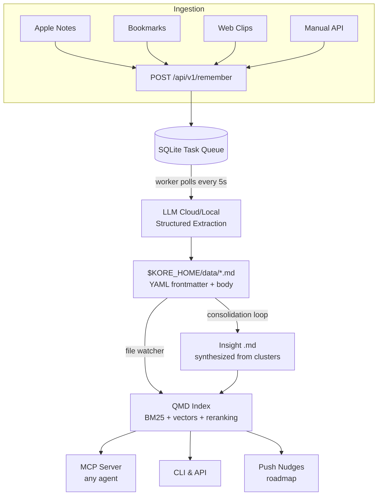

# I Built a Personal Memory Bank With AI. Here's My Experience.

Those one-shot prompt demos on X to build a full app are impressive. But real projects are built incrementally: a new feature idea shows up, gets refined, designed, implemented, tested, then you're on to the next thing.

So the more interesting question isn't "can AI build an app?" It's: how much can you hand over? And where do you still need to be in the loop?

I've been poking at this while building [Kore](https://github.com/eho/kore/blob/main/README.md), a personal memory bank that ingests your notes and makes them retrievable by AI — think of it as a local-first, searchable second brain. I'm a solo hobbyist — Claude Pro and Google AI Pro, not some corporate unlimited plan — so I can't just let AI go wild and see what sticks. Tokens are limited. And honestly, I genuinely enjoy the process. I want to understand what gets built and be able to steer it the way I would have done it myself.

What I found: the overall process hasn't really changed. AI has taken over a large chunk — coding, testing, PRs — but design still needs human input. This is more a redistribution of responsibilities than a replacement of the process.

---

## Starting with Vision

Before any code, I started with the vision. I had a bunch of loose ideas about what I wanted Kore to be — a place to ingest Apple Notes, bookmarks, and all the other loosely connected spots where I keep knowledge, index it locally, and let AI retrieve relevant context through MCP — and AI is genuinely great at this part. I'd dump my thoughts, tell it to interview me on the topic, and it'd ask clarifying questions one by one. Once it had enough, it'd synthesize everything into something coherent. What would've taken me days staring at a blank doc came together in a few sessions — the result was a [vision doc](https://github.com/eho/kore/blob/main/docs/vision/vision.md) I was actually happy with.

From there, I asked AI to help with system-level architecture: competitor analysis, gap analysis, research on existing work in the space. It'd ask me questions to fill in the blanks. For example, AI analyzed [QMD](https://github.com/eho/kore/blob/main/docs/analysis/qmd_architecture_and_search.md) — the local search and indexing engine Kore is built on — and broke down exactly how its hybrid search pipeline worked, which directly shaped Kore's retrieval design. It also analyzed [memU](https://github.com/eho/kore/blob/main/docs/analysis/memu_learnings.md), an open-source memory system, and surfaced how its hierarchical memory model and dual-mode retrieval approach could map onto what I was building.

That kind of research would have taken me days on my own. But I still had to make the actual directional calls: plugin architecture over feature coupling, what to cut from MVP. AI can lay out options and tradeoffs. It can't decide what you're actually trying to build.

## Designing the System



Once I had a clear [architecture](https://github.com/eho/kore/blob/main/docs/architecture/architecture.md), I had AI generate the technical design — the [API surface](https://github.com/eho/kore/blob/main/docs/architecture/api_design.md), [data schema](https://github.com/eho/kore/blob/main/docs/architecture/data_schema.md), [storage and indexing approach](https://github.com/eho/kore/blob/main/docs/architecture/storage_and_indexing.md), the [plugin system](https://github.com/eho/kore/blob/main/docs/architecture/plugin_system.md) (so new ingestion sources like Apple Notes or browser bookmarks could be added without touching the core). I used Opus 4.6 for the initial design, then passed it to Gemini 3.1 Pro to review and critique. The feedback went back to Opus, which would either adopt or reject it. A few times it pushed back on the review. I kept bouncing between models, refining, until I was happy with where it landed.

Part of the back-and-forth was making sure the design had enough technical detail for an AI agent to actually implement from — not just high-level intent, but concrete enough that nothing important would be left to interpretation. The other part was making sure it stayed aligned with the vision and architecture rather than drifting into something technically interesting but off-track.

This took real time. I wasn't writing the design from scratch — but I was steering it, challenging it, poking at edge cases.

## Breaking It Into Stories

Once I had a solid design, the question was how to get AI to implement it without losing the thread.

I didn't want to hand the whole thing over and get back a black box. So I created a `/prd` skill: give it the design doc, get back a PRD with user stories and acceptance criteria in a consistent format. Each story ends up looking like:

```markdown
### KOR-001: Initialize plugin registry

**Acceptance Criteria:**
- [ ] `PluginRegistry` class defined with `register()` and `resolve()` methods
- [ ] Unit tests covering registration and lookup
```

That level of specificity matters. "Handle edge cases" produces nothing testable. Method signatures and explicit criteria produce actual code.

I initially tracked story progress in a local markdown file — the agent would check things off as it went. That got annoying fast, so I wrote `/prd-to-github-milestone` to push the stories to GitHub issues. Much easier to track, and it gave me a natural place to coordinate the workflow.

## Handing Off Implementation

With stories in GitHub, I'd kick off `/user-story-implementer` one story at a time. The agent pulls the next open issue, implements it, and opens a PR. I'd then run `/user-story-reviewer` against it — checks the PR against the acceptance criteria and either leaves comments or merges.

I was manually orchestrating this loop and got through 7-8 stories in about two days, watching token consumption the whole time.

One thing that made it work better: I made sure each agent started with a fresh context before picking up a story. It costs more tokens because the agent re-analyzes the codebase each time, but the output was cleaner.

For reviews, I experimented with Gemini 3.1 Pro instead of Opus 4.6. It was noticeably better at catching systemic issues. It found a concurrency bug that the Opus reviewer missed.

Once the initial set of stories was done, I had a basic working memory system. I then added new features — the Kore CLI, [Apple Notes integration](https://github.com/eho/kore/blob/main/docs/design/apple_notes_integration_design.md), [Memory Consolidation](https://github.com/eho/kore/blob/main/docs/design/consolidation_system_design.md) — each as its own design cycle. Same process each time: refine the design, generate a PRD with `/prd`, push stories to GitHub with `/prd-to-github-milestone`, then work through them with the implementer and reviewer skills.

I'm still manually orchestrating the workflow — triggering each step myself. It wouldn't take much to automate it, and that's probably next.

## Where It Landed

The upfront design investment is real, and it's worth it. Once a solid design exists, implementation is mostly coordination. The design phase is where time goes now — not coding.

Kore is now running — it stores and indexes my Apple Notes, and AI can retrieve from it via MCP. I haven't fully validated how effective it is as a personal memory bank yet, but I already have ideas on how to use it in my next project. So it worked well enough to keep going.

I'm still figuring out the workflow. The models keep getting better and the process keeps shifting with them. But the basic shape — vision to architecture to design to stories to code — held up across the whole project. That part I'd do the same way again.

---

## What's Next?

If you're building with AI agents or exploring local-first architectures, I'd love to hear about your workflow. 

* Check out the code for Kore on [GitHub](https://github.com/eho/kore).
* Feel free to reach out or drop a star if you find the project interesting!
